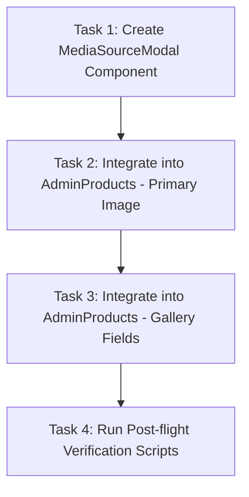

# Implementation Plan - Media Source Picker Modal

This document outlines the detailed implementation plan for adding a media source selection modal to the Product Edit/Create workflow within `AdminProducts.tsx`. This feature enables administrators to choose between uploading new files directly from their computer and selecting previously uploaded assets from the Firestore `media` collection.

---

## 📋 Overview

The administration product editor currently forces a direct file upload from "Computer Storage" for the **Primary Product Image** and **Gallery** fields. This creates redundant storage uploads and doesn't allow admins to reuse existing brand assets.
By introducing a reusable `MediaSourceModal`, we give admins a unified picker interface to:
1. **Choose from Uploaded Media:** Select files from the Firestore `media` collection with search, sorting, filtering, and pagination.
2. **Computer Storage:** Directly upload new images which will automatically be optimized to WebP and added to the Firestore `media` library.

---

## 🎨 Tech Stack & UX Guidelines

- **Core Framework:** React 18, TypeScript, Tailwind CSS
- **Database/Storage:** Cloud Firestore (querying the `media` collection) and Firebase Storage
- **UI Elements & Styling:**
  - Glassmorphic, dark-mode-first aesthetic with `#39FF14` (Neon Green) active accents.
  - Hover effects, transitions, and grid/list view toggles.
  - No purple or violet color tokens (per project UI guidelines).
- **Icons:** `lucide-react` (specifically using `ImageIcon`, `Upload`, `Search`, `Grid`, `List`, `Trash2`, `Plus`, `X`, etc.)

---

## 🗺️ File Structure

The following files will be added or modified:
```
TRIP E-Bikes App/
├── src/
│   ├── components/
│   │   └── features/
│   │       └── MediaSourceModal.tsx        # NEW: Reusable modal component
│   └── pages/
│       └── admin/
│           └── AdminProducts.tsx           # MODIFIED: Integrates the picker into product forms
```

---

## 📝 Task Breakdown



### Task 1: Create Reusable `MediaSourceModal` Component
- **Agent:** `frontend-specialist`
- **Skills:** `@[skills/clean-code]`, `@[skills/frontend-architecture]`
- **Priority:** High
- **Dependencies:** None
- **Description:** 
  Create `src/components/features/MediaSourceModal.tsx` supporting:
  - Multi-select capability (configurable for gallery vs. single-select for primary image).
  - Two view tabs: "Uploaded Media" and "Upload New".
  - "Uploaded Media" retrieves real-time documents from the `media` Firestore collection, filtered by type `image`. Includes search input, sorting dropdown (date, name, size), and grid layout with image previews.
  - Interactive "Selected" state with checkmarks.
  - Confirm and cancel actions.
- **INPUT:** Firestore connection (`db` from `@/lib/firebase`), tailwind styles.
- **OUTPUT:** Functional `MediaSourceModal` component.
- **VERIFY:** Component loads, displays Firestore images, handles search, and fires selection callbacks correctly.

### Task 2: Integrate into `AdminProducts.tsx` - Primary Image
- **Agent:** `frontend-specialist`
- **Skills:** `@[skills/clean-code]`
- **Priority:** High
- **Dependencies:** Task 1
- **Description:**
  Modify `AdminProducts.tsx` to replace the direct file input for the "Primary Product Image" with the new `MediaSourceModal` (in single-select mode).
- **INPUT:** `AdminProducts.tsx` source code, `MediaSourceModal` import.
- **OUTPUT:** Updated "Primary Image" upload interface launching the picker modal.
- **VERIFY:** Clicking "Select Primary Image" opens the modal, selecting an image and hitting "Save" updates the form state successfully.

### Task 3: Integrate into `AdminProducts.tsx` - Gallery Images
- **Agent:** `frontend-specialist`
- **Skills:** `@[skills/clean-code]`
- **Priority:** High
- **Dependencies:** Task 1, Task 2
- **Description:**
  Modify `AdminProducts.tsx` to integrate the `MediaSourceModal` into the "Gallery" field, allowing multi-selection.
- **INPUT:** `AdminProducts.tsx` source code, `MediaSourceModal` import.
- **OUTPUT:** Updated "Gallery" field allowing selection of multiple assets simultaneously.
- **VERIFY:** Selecting multiple images from the modal adds them all to the product gallery array.

---

## 🧪 Phase X: Verification Checklist

### 1. Build & Lint Verification
Execute build and lint scripts to ensure type-safety and correct imports:
```powershell
npm run lint
npx tsc --noEmit
npm run build
```

### 2. Automated Scanning
Ensure the new component complies with accessibility, UX standards, and security policies:
```powershell
python .agents/skills/vulnerability-scanner/scripts/security_scan.py .
python .agents/skills/frontend-design/scripts/ux_audit.py .
```

### 3. Manual UX Checklist
- [ ] No purple or violet color styling used.
- [ ] Responsive modal rendering smoothly on desktop and mobile viewports.
- [ ] Confirming selection dismisses the modal and updates form state instantaneously.
- [ ] Searching/filtering media items works without resetting selection states.
